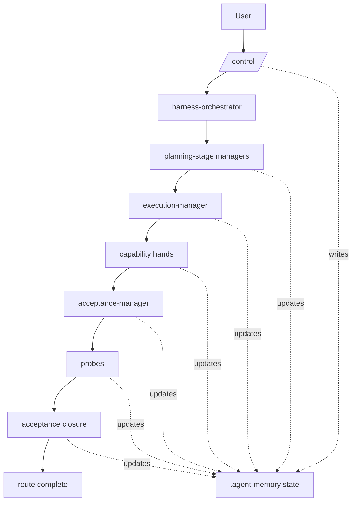

# OMO Harness Agent

OMO Harness Agent turns OpenCode from a prompt-only workflow into a managed, route-driven runtime. Instead of asking one generalist agent to do everything, it gives you a real control plane for intake, planning, execution, acceptance, retries, deliverables, and operator-visible state.

At a practical level, this repo gives you:

- a local Harness plugin that intercepts `/control`, `/plan`, `/drive`, and `/check`
- a layered managed-agents model with brain, managers, hands, and probes
- durable `.agent-memory/` state and route artifacts
- graph-aware progression with bounded concurrency, lock-aware execution, signals, and graph-based closure gating
- isolated launcher profiles so Harness mode and OMO mode do not blur together

---

## What this system is

Harness mode is built around one idea: **`/control` should initialize and supervise work, not pretend to finish it in one prompt.**

The runtime now treats structured work as an explicit route:

- **`F-M1`** — fix something already broken
- **`C-M1`** — bounded internal change or refactor
- **`A-M1`** — deeper capability upgrade
- **`P-H1`** — product-surface or journey-heavy work

Each route moves through intake, planning, execution, acceptance, and final closure with state you can inspect at any time.

---

## Architecture at a glance



### Runtime layers

- **L1 brain**: `harness-orchestrator`
- **L2 managers**: `feature-planner`, `capability-planner`, `planning-manager`, `execution-manager`, `acceptance-manager`
- **L3 hands**: `docs-agent`, `browser-agent`, `code-agent`, `shell-agent`, `evidence-agent`
- **L4 probes**: `ui-probe-agent`, `api-probe-agent`, `regression-probe-agent`, `artifact-probe-agent`

The plugin is the control plane. Skills define behavior. Hooks enforce integrity. Agents provide role separation.

---

## Quick start

### 1. Clone and install

```bash
git clone git@github.com:ylx134/OMO-harness-agent.git
cd OMO-harness-agent
./setup.sh
python3 scripts/setup-opencode-profiles.py
```

### 2. Start Harness mode

```bash
opencode-harness-pure --agent harness-orchestrator .
```

Or point it at another project:

```bash
opencode-harness-pure --agent harness-orchestrator /path/to/project
```

### 3. Run a real route

```text
/control 修复构建报错并补上回归验证
```

By default, `/control` may auto-dispatch the first legal actor once intake is stable. If you want pure intake-only initialization, use `--manual` and then advance with `/plan`, `/drive`, and `/check` yourself.

---

## Installation details

### What `./setup.sh` does

`setup.sh` installs the current local checkout into your OpenCode config by:

- building the plugin package from `plugin/src/**` into `plugin/dist/**`
- installing the local plugin package from `./plugin`
- symlinking skills into `~/.config/opencode/skills`
- symlinking hooks into `~/.config/opencode/hooks`
- symlinking harness agent files into `~/.config/opencode/agents/agent`
- merging `oh-my-opencode.json` categories/experimental settings
- merging Harness agent entries into `oh-my-openagent.json`
- registering the local plugin path in `opencode.json`
- snapshotting the pre-install config so uninstall can restore prior user-owned values

### What `scripts/setup-opencode-profiles.py` does

This creates isolated launch profiles under `~/.config/opencode-profiles/` and launcher scripts under `~/.local/bin/`.

It creates:

- `opencode-harness`
- `opencode-harness-pure`
- `opencode-omo`

### Uninstall

```bash
./uninstall.sh
```

This removes the linked skills/hooks/agent files, unregisters the local Harness plugin path, and restores the pre-install config snapshot when one exists.

---

## Which launcher should you use?

| Launcher | What it loads | When to use it |
|---|---|---|
| `opencode-harness-pure` | Harness plugin only | Cleanest and most predictable Harness behavior |
| `opencode-harness` | OMO + Harness plugin | Compatibility experiments or mixed behavior |
| `opencode-omo` | `oh-my-openagent@latest` only | Original OMO/Sisyphus behavior with no Harness plugin |

If you want the cleanest Harness-only entrypoint, use `opencode-harness-pure --agent harness-orchestrator`.

---

## Command lifecycle

```mermaid
flowchart LR
    C[/control/] --> I[Intake only]
    I --> R[Route selected + state written]
    R --> P[/plan/]
    P --> PM[Planning-stage managers]
    PM --> D[/drive/]
    D --> EM[execution-manager]
    EM --> H[capability hands<br/>bounded concurrency + locks]
    H --> K[/check/]
    K --> AM[acceptance-manager]
    AM --> PR[probes<br/>bounded concurrency]
    PR --> CL[acceptance closure<br/>graph terminal + deliverables]
    CL --> X[complete]
```



### What each command really means

- **`/control`**: intake only. It chooses the route, writes authoritative state, and starts the first legal actor if the mode allows it.
- **`/plan`**: advances the planning stage.
- **`/drive`**: advances execution. It dispatches `execution-manager` first, then eligible capability hands subject to current budgets and held locks.
- **`/check`**: advances acceptance. It dispatches `acceptance-manager`, then eligible probes, then closure once the graph is terminal and deliverables are real.

---

## Route families

| Route | Use when | Planning path | Execution / acceptance behavior |
|---|---|---|---|
| `F-M1` | something is broken and must stop failing | `planning-manager` | fix-oriented execution, evidence, regression + artifact probes |
| `C-M1` | scoped internal change or bounded refactor | `planning-manager` | behavior-preserving execution, bounded acceptance |
| `A-M1` | a deeper capability must become real | `capability-planner` -> `planning-manager` | capability-first execution with stronger planning upfront |
| `P-H1` | a product surface or broader journey is being built | `feature-planner` -> `planning-manager` | strongest route, product-oriented execution, no silent single-thread fallback |

---

## What gets written to `.agent-memory/`

These files are the operator-facing source of truth during a run.

### `harness-plugin-state.json`

The authoritative machine-readable runtime state.

Key fields include:

- `routeId`
- `currentPhase`
- `nextExpectedActor`
- `deferredDispatchState`
- `completedDeliverables`
- `graph`
- `stepRuntime`
- `activeStepIds`
- `readyStepIds`
- `blockedStepIds`
- `heldLocks`
- `signals`
- `childDispatchSessionIDs`

### `orchestration-status.md`

The human-readable summary for operators.

It includes both:

- **Graph Runtime Summary** — active/ready/blocked steps, held locks, signal counts
- **Legacy Compatibility View** — queue-shaped fields like `pendingManagers`, `pendingCapabilityHands`, `pendingProbes`, `deferredDispatchState`, and `activeDispatch`

### `route-packet.json`

The durable route contract.

This includes:

- route meaning (`reasonForLane`, `routingContractRow`)
- required startup/planning/execution/acceptance files
- required deliverables and current missing deliverables
- graph runtime fields
- legacy compatibility projection

### `managed-agent-state-index.json`

The machine-readable operator status index.

This preserves queue-oriented compatibility fields while also exposing:

- `graph_runtime.active_step_ids`
- `graph_runtime.ready_step_ids`
- `graph_runtime.blocked_step_ids`
- `graph_runtime.held_locks`
- `graph_runtime.signal_summary`
- `legacy_compat`

### `harness-plugin-debug.log`

The runtime truth source when something looks wrong.

Use it to inspect:

- command intake
- dispatch requests
- duplicate dispatch skips
- retryable errors
- deliverable-gated closure blocking

---

## Concurrency, locks, and signals

The current runtime is no longer purely queue-serial.

### Capability hands

Capability hands can fan out **within bounded concurrency** when their required locks do not conflict.

Current conservative lock groups include:

- `workspace-write`
- `build-runner`
- `docs-write`
- `evidence-write`

### Probes

Probes can also run with bounded concurrency after `acceptance-manager` has completed.

### Signals

Graph steps can emit durable signals. A blocked step can stay idle until both:

- its step dependencies are complete
- its signal dependencies are emitted

This is how wait/wake behavior works without relying on paused child sessions.

---

## Completion semantics

Harness is intentionally stricter than “the queues are empty”.

A route is fully complete only when:

- `currentPhase` is `complete`
- `nextExpectedActor` is `none`
- the graph has no remaining live or required terminal work
- required deliverables exist
- placeholder/scaffold files do **not** falsely count as completed deliverables

If required deliverables are still missing, closure stays blocked or retryable by design.

Healthy final state usually looks like:

- `currentPhase: "complete"`
- `nextExpectedActor: "none"`
- `pendingManagers: []`
- `pendingCapabilityHands: []`
- `pendingProbes: []`
- `deferredDispatchState: "complete"`
- `missingDeliverables: []`

---

## Typical flows

### `F-M1` fix flow

```text
/control 修复构建报错并补上回归验证
/plan
/drive
/drive
/drive
/check
/check
/check
```

### `P-H1` product flow

```text
/control 为现有系统搭建一个完整产品级功能，覆盖关键用户旅程与发布质量
/plan
/plan
/drive
/drive
/drive
/check
/check
/check
```

The exact number of `/drive` and `/check` repetitions depends on the selected managers, hands, probes, lock conflicts, and deliverable state.

---

## How to verify a live run

If something looks wrong, check in this order:

```bash
# Quick one-line status
hctl summary

# Full runtime status
hctl status

# What's blocking progress
hctl blockers

# Event timeline
hctl trace
hctl events --last 20
```

For manual inspection:
1. `.agent-memory/harness-plugin-state.json`
2. `.agent-memory/orchestration-status.md`
3. `.agent-memory/route-packet.json`
4. `.agent-memory/managed-agent-state-index.json`
5. `.agent-memory/harness-plugin-debug.log`

### Runtime safety guards

The harness now includes automatic structural integrity checks:
- **Schema validation** — `routing-table.json`, `features.json`, and `state-index.json` are validated against JSON Schemas on every write, preventing silent corruption
- **Summary-first supervision** — a hook warns when brain/manager agents read raw detail files instead of staying at the summary layer, catching drift from the summary-first architecture
- **All existing hooks** continue to enforce manager/hand/probe boundaries, evidence requirements, and features.json immutability

For plugin-local validation, this repo’s main check is:

```bash
npm --prefix plugin test
```

---

## Repository structure

```text
omo-harness-skills/
├── control/                    # route selection and orchestration contracts
├── plan/                       # planning-manager skill
├── drive/                      # execution-manager skill
├── check/                      # acceptance-manager skill
├── feature-planner/            # product planning skill
├── capability-planner/         # capability planning skill
├── browser-agent/
├── code-agent/
├── shell-agent/
├── docs-agent/
├── evidence-agent/
├── ui-probe-agent/
├── api-probe-agent/
├── regression-probe-agent/
├── artifact-probe-agent/
├── hooks/
│   ├── schema-guard.js           # validates state files against schemas
│   ├── summary-supervision-guard.js # warns on summary-first violations
│   ├── schemas/                  # JSON Schema definitions for state files
│   └── ...                       # other boundary-enforcement hooks
├── plugin/                     # Harness runtime control plane
├── scripts/
│   ├── harness                   # observability CLI (status/trace/blockers)
│   └── ...                       # other utility scripts
├── agents/
├── docs/
├── setup.sh
├── uninstall.sh
└── scripts/setup-opencode-profiles.py
```

---

## Recommended default

If you want the shortest, cleanest, most stable daily entrypoint:

```bash
harness .
```

To inspect a running harness:

```bash
hctl status      # full runtime panel
hctl blockers    # what's blocking progress
hctl summary     # one-line shell prompt
```

If you want the cleanest mental model, remember just this:

> `harness` starts Harness mode, `/control` initializes a route, and `/plan` / `/drive` / `/check` advance it step by step until the graph and deliverables say it is truly done. Use `hctl` to observe the runtime state.
